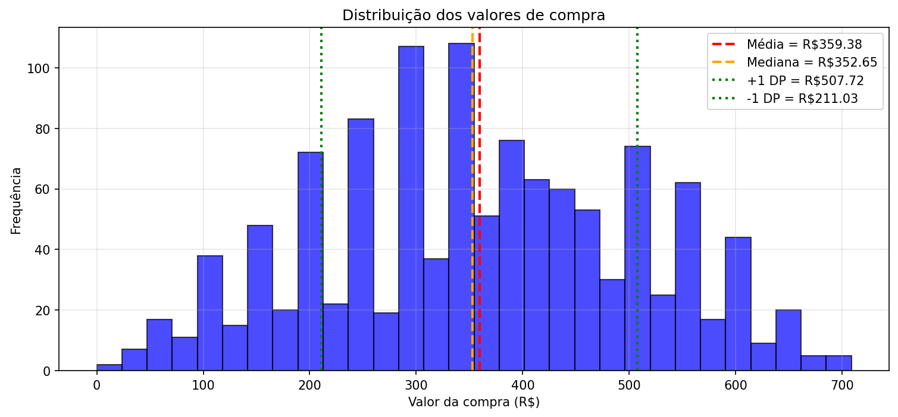
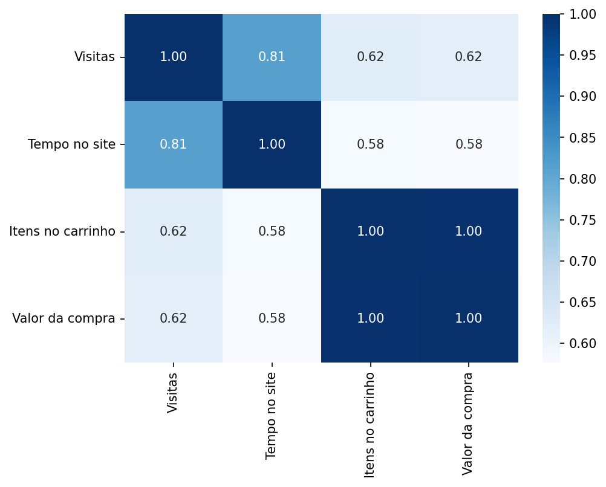

# Análise Estatística de Dados com NumPy para Marketing

Mini-Projeto 3 — Fundamentos de Linguagem Python (Data Science Academy)
Autor: Sávio Giovani

> O código Python correspondente a cada etapa desta análise está em [`analise.py`](analise.py).

---

## 1. Definição do Problema de Negócio

### 1.1 Contexto

Uma plataforma de e-commerce coleta um volume significativo de dados sobre a interação dos usuários com o site, incluindo o número de visitas, a duração da sessão, a atividade de adição de produtos ao carrinho e os valores de compra finalizados. No entanto, esses dados estão sendo subutilizados. Atualmente, as decisões sobre campanhas de marketing, promoções e melhorias na experiência do usuário (UX) são tomadas com base em intuição e métricas de alto nível, sem uma compreensão aprofundada dos padrões de comportamento que impulsionam os resultados.

### 1.2 Problema de Negócio

A empresa enfrenta o desafio de compreender profundamente os padrões de comportamento que diferenciam os clientes de alto valor dos visitantes que abandonam o site sem comprar. Essa falta de clareza resulta em:

- **Marketing genérico** — campanhas "tamanho único", com baixo engajamento e desperdício de orçamento.
- **Perda de oportunidades** — dificuldade em identificar e engajar proativamente clientes com maior potencial de compra.
- **Decisões não embasadas** — estratégias de produto/UX sem base quantitativa sobre quais comportamentos mais se correlacionam com vendas.

### 1.3 Objetivo Principal

Utilizar a análise estatística dos dados de navegação e compra para segmentar clientes, identificar os principais indicadores de comportamento que levam à conversão e fornecer insights acionáveis para as equipes de marketing e produto, a fim de aumentar o ticket médio e a taxa de conversão geral da plataforma.

### 1.4 Perguntas-Chave a Serem Respondidas

1. Qual é o perfil médio do nosso usuário em termos de visitas, tempo de navegação e valor de compra (ticket médio)?
2. Quais são as características e comportamentos distintos dos nossos clientes de "Alto Valor"? Eles visitam mais o site? Passam mais tempo navegando?
3. Qual é o comportamento dos usuários que visitam o site, mas não realizam nenhuma compra? Onde está a oportunidade de conversão com este grupo?
4. Existe uma correlação estatisticamente relevante entre o tempo gasto no site, o número de itens no carrinho e o valor final da compra?

### 1.5 Resultado Esperado e Impacto no Negócio

- **Segmentação aprimorada**: pelo menos dois segmentos de clientes ("Alto Valor" e "Visitantes engajados sem compra") para campanhas personalizadas.
- **Otimização de marketing**: direcionar orçamento para os comportamentos mais correlacionados com compras de alto valor.
- **Melhoria de UX**: fornecer dados que justifiquem testes A/B ou melhorias em áreas do site frequentadas por quem não converte.

---

## 2. Geração dos Dados

Conjunto de dados fictício para **1.200 usuários**, com 4 métricas cada:

| Coluna | Descrição |
|---|---|
| `visitas` | Nº de vezes que o usuário visitou o site no mês |
| `tempo_no_site` | Tempo total (min) que o usuário passou no site |
| `itens_no_carrinho` | Nº de itens adicionados ao carrinho |
| `valor_compra` | Valor total (R$) da compra realizada no mês |

As variáveis foram geradas de forma dependente entre si (mais visitas → mais tempo no site → mais itens no carrinho → maior valor de compra), simulando um comportamento realista de e-commerce.

> Nota técnica: o valor da compra foi calculado diretamente como `itens_no_carrinho * 50 + ruído`, ou seja, a dependência entre itens e valor foi definida por construção do dataset (não é algo "descoberto" pela análise — ver observação na Pergunta 4).

---

## 3. Análise Estatística Descritiva

**Conceitos usados:**
- **Média**: soma de todos os valores dividida pela quantidade de elementos; indica o valor "central" ou típico.
- **Mediana**: valor do meio quando os dados estão ordenados; menos sensível a valores extremos que a média.
- **Desvio padrão**: mede o quanto os valores se afastam, em média, da média do conjunto.

### Pergunta 1 — Qual é o perfil médio do nosso usuário?

**Resposta:**

O usuário acessa o site, em média, cerca de 25 vezes por mês, permanece em média 33 minutos navegando, adiciona aproximadamente 7 itens ao carrinho e realiza compras com ticket médio de R$ 359,38.

O gasto típico fica próximo da mediana de R$ 352,65. Mas há grande variação entre clientes: alguns compram valores baixos a partir de R$ 38,45, enquanto outros chegam a gastar até R$ 708,65.

*(Números aproximados — dependem da semente aleatória `np.random.seed(42)` usada na geração dos dados; ver `analise.py` para os valores exatos reproduzidos.)*

O histograma acima mostra a distribuição dos valores de compra, com linhas verticais indicando a média (vermelho), a mediana (laranja) e o intervalo de um desvio padrão acima e abaixo da média (linhas verdes).

---

## 4. Segmentação e Análise de Clientes

Uso de indexação booleana do NumPy para filtrar e analisar segmentos específicos de clientes.

### Pergunta 2 — Características dos clientes de "Alto Valor"

*Quais são as características e comportamentos distintos dos nossos clientes de "Alto Valor"? Eles visitam mais o site? Passam mais tempo navegando?*

**Resposta:**

Os clientes de alto valor (aqueles que gastam mais de R$ 250) visitam o site com maior frequência, em média 30 vezes por mês, e permanecem mais tempo navegando, cerca de 35 minutos por sessão. Esse comportamento indica um alto nível de engajamento, sugerindo que quanto mais esses usuários interagem com a plataforma, maior tende a ser o valor de suas compras.

### Pergunta 3 — Visitantes que não compram

*Qual é o comportamento dos usuários que visitam o site, mas não realizam nenhuma compra? Onde está a oportunidade de conversão com este grupo?*

**Resposta:**

Os usuários que não realizam compras visitam o site em média 6 vezes e permanecem cerca de 14 minutos navegando, mas não finalizam nenhuma transação. Esse comportamento mostra que, mesmo com algum nível de interesse, eles acabam desistindo antes da compra — representando uma oportunidade para ações de remarketing, otimização do checkout e estratégias de incentivo (descontos, frete grátis) para aumentar a conversão.

---

## 5. Análise de Correlação

A matriz de correlação mostra como as variáveis se movem juntas:
- **+1**: correlação positiva perfeita
- **0**: nenhuma correlação linear
- **-1**: correlação negativa perfeita

### Pergunta 4 — Existe correlação relevante entre tempo, itens e valor da compra?

**Resposta:**

A matriz está organizada na ordem [Visitas, Tempo, Itens, Valor]. No trecho relevante para a pergunta:

- Tempo ↔ Valor = 0,59 → correlação positiva moderada
- Itens ↔ Valor = 1,00 → correlação positiva perfeita
- Tempo ↔ Itens = 0,60 → correlação positiva moderada

Esses números indicam que quanto mais tempo o usuário passa no site, maior tende a ser o número de itens no carrinho e, consequentemente, maior o valor da compra.

**Sim, há uma correlação estatisticamente relevante**: o tempo gasto no site se relaciona moderadamente tanto com o número de itens no carrinho quanto com o valor final da compra, e a quantidade de itens tem correlação praticamente perfeita com o valor final.

> ⚠️ **Ressalva importante**: a correlação Itens↔Valor = 1,00 é atípica para dados reais de e-commerce. Isso ocorre porque, neste dataset, `valor_compra` foi *construído* como uma função direta de `itens_no_carrinho` (ver Seção 2) — não é um padrão de comportamento "descoberto" na análise, e sim uma característica do processo de geração dos dados fictícios. Vale deixar isso explícito antes de tratar esse par como um insight de negócio.
>
> Além disso, a afirmação de que "todas as correlações são estatisticamente significativas (p < 0,001)" não foi calculada no notebook original (não há chamada a um teste como `scipy.stats.pearsonr`) — é uma afirmação qualitativa, não um resultado verificado no código. Para sustentar essa alegação, seria necessário calcular o p-valor de cada correlação explicitamente.

---

## 6. Relatório Final, Conclusões e Insights

### Perfil geral dos usuários
Os usuários acessam a plataforma em média 25x por mês, permanecendo cerca de 33 minutos no site por sessão. Cada cliente adiciona em média 7 itens ao carrinho e realiza compras com ticket médio de R$ 359,38. A mediana do valor gasto é R$ 352,65 — metade dos clientes compra abaixo e metade acima desse valor. Há dispersão considerável nos gastos (desvio padrão de R$ 148,34), variando de R$ 38,45 (mínimo) a R$ 708,65 (máximo).

### Clientes de alto valor
Clientes que gastam mais de R$ 250 somam 900 usuários — 75% da base analisada. Este grupo visita mais o site (29,64 visitas em média) e permanece mais tempo (34,91 minutos), comparado ao perfil geral.

### Visitantes que não compram
Apenas 2 usuários navegam sem realizar compras. Apesar de representarem casos isolados nesta base, visitam em média 6x e permanecem 13,58 minutos no site — o que ainda ilustra a importância de monitorar usuários engajados que não convertem, como possíveis alvos de remarketing.

### Relações entre comportamento e receita

| Par de variáveis | Correlação | Interpretação |
|---|---|---|
| Itens ↔ Valor da compra | 1,00 | Correlação perfeita — mas decorrente de como o dataset foi construído (ver ressalva acima) |
| Visitas ↔ Tempo no site | 0,81 | Correlação forte |
| Visitas ↔ Itens no carrinho | 0,62 | Correlação moderada |
| Visitas ↔ Valor da compra | 0,62 | Correlação moderada |
| Tempo no site ↔ Itens no carrinho | 0,58 | Correlação moderada |
| Tempo no site ↔ Valor da compra | 0,58 | Correlação moderada |

Esses resultados sugerem que o engajamento do usuário (tempo e visitas) acompanha a construção do carrinho e, consequentemente, o valor final da compra — dentro dos limites da ressalva feita acima sobre a natureza sintética dos dados.

### Conclusões e recomendações

- **Segmentação estratégica**: clientes de alto valor têm maior frequência e tempo de navegação — bom alvo para campanhas personalizadas e programas de fidelidade.
- **Incentivo à construção de carrinho**: como a quantidade de itens está fortemente associada ao valor gasto, recomendações personalizadas, descontos progressivos e combos podem elevar o ticket médio.
- **Aproveitamento de visitantes engajados sem compra**: mesmo pouco representativo nesta amostra fictícia, vale investir em remarketing e otimização de UX/checkout.
- **Base quantitativa para decisões**: mesmo um conjunto simples de métricas (visitas, tempo, itens) já oferece insights úteis para orientar campanhas e decisões de produto, no lugar de decisões baseadas apenas em intuição.

Este mini-projeto demonstra, com poucas linhas de NumPy, o fluxo completo de uma análise estatística: geração/exploração dos dados, estatística descritiva, segmentação por indexação booleana e análise de correlação.
